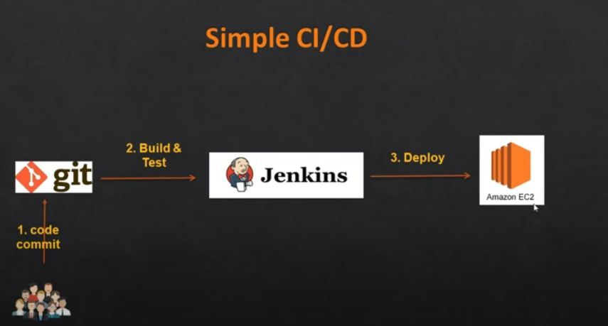
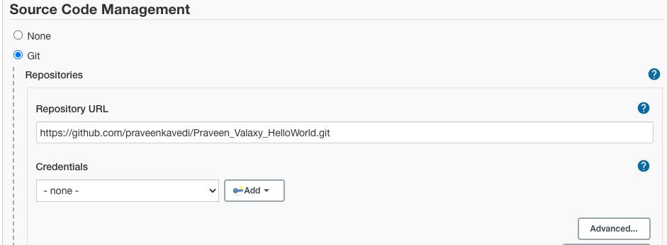
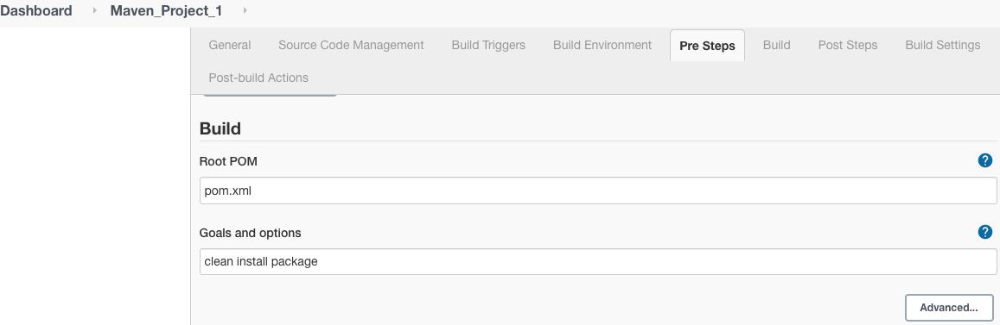
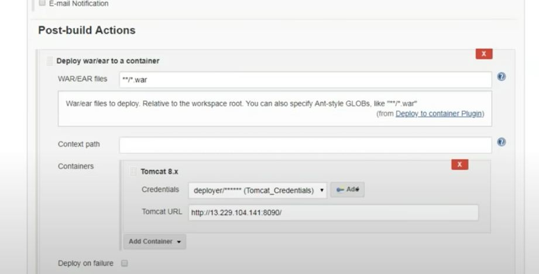

# Summary
  Once the user update/Modify the code in Github, it will tigger the Jenkins job. Jenkins will start the build the war/Jar file and test the code to achieve Continous Integration.  Next for Continous Deployment, the War/Jar file has been deployed in Tomcat server which is running in AWS Instance. 
 
 
 
# Tools Used

- Git for Version Control
- Jenkins for CI/CD
- AWS for Instance
- Maven Build Automation tool
- Tomcat for Web Server/Application Server

# Prerequisite
  We have to be ready with the below steps for successful integration, 
   # 1. AWS
      Create Three Rehat linux instance for Maven, Jenkins and Tomcat each. 
   # 2. Maven Installation 
    Install Maven in AWS Instance with the below steps, 
        * Once Maven is installed Stepup M2_Home and M2 Path is .bash_Profile of user
              M2_HOME=/opt/maven/apache-maven-3.5.3
              M2=$M2_HOME/bin
   # 3. Install Jenkins and plugins 
    Login to Jenkins Instance and install the below plugins, 
         * Maven Invoker and Github
         * Set the Maven and Github paths in Jenkins.
   # 4. Install Tomcat     
     Install Tomcat in another Instance, 
          * Install Java and set the Java_Home Path
          * update the user in tomcat-user.xml file and add the users
          * Change the default Port number running from 8080 to 8090
          * Start the tomcat
# CI/CD Steps,
   Create a Job in Jenkins\
   Give our Git Repo Url
   
   
   
   Modify Build as per below image,
   
   
   
   Save and Apply Changes\
   CI is completed here
   
   Once CI is done proceed with CD
   - Install "Deploy to container" plugin to deploy the war file in some container in our case it is TOMCAT. 
   - Add the Credentials, Give the Tomcat credentails which we updated in tomcat-user.xml file
   - Add the Post build step as per the below image, 
     
   
     
   - Add the Build Triggers to Trigger the job every two minutes as per the below image.
   
